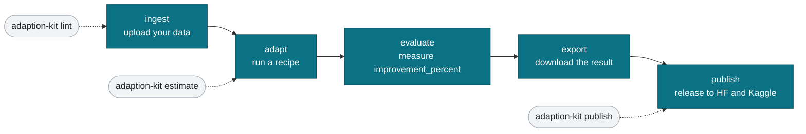

# Repo map

Open this file to orient yourself in about one minute. adaption-devkit is a
community, unofficial, open source toolkit (Apache-2.0) for moving fast with
Adaption's Adaptive Data and AutoScientist. It is not affiliated with or endorsed
by Adaption Labs. The official Adaption documentation and API are always the
source of truth for the platform; this kit only wraps them with convenience
tooling.

## What lives where

| Path | What it is | Reach for it when |
|------|------------|-------------------|
| `README.md` | The front door: what the kit is, install, quickstart. | You want the high level pitch and setup. |
| `MAP.md` | This file: the one minute map of the repo. | You are new and want your bearings. |
| `FAQ.md` | Honest questions a newcomer asks, with short answers. | Something surprised you and you want a quick answer. |
| `GLOSSARY.md` | Plain language definitions of the key terms. | A word like anchor, recipe, or blueprint is unfamiliar. |
| `SECURITY.md` | How to report a concern, and the rule on never committing keys. | You found a security issue or want the key handling policy. |
| `CHANGELOG.md` | What changed, version by version. | You want to know what is in a release. |
| `CONTRIBUTING.md` | How to contribute and the quality bar. | You want to open a pull request. |
| `CODE_OF_CONDUCT.md` | Contributor Covenant v2.1. | Before you take part in the community. |
| `adaption_kit/` | The Python package and the `adaption-kit` CLI. | You want to run a command or read the source. |
| `guides/` | Five focused guides (see below). | You want to learn one part of the lifecycle well. |
| `cookbook/` | Runnable notebooks that walk the full lifecycle. | You learn best by running real code. |
| `templates/` | Dataset schemas, dataset and model cards, a cover, Kaggle metadata. | You are preparing a release. |
| `graphics/` | The diagrams embedded in the README, as Mermaid in Markdown. | You want the source of a diagram. |
| `pyproject.toml` | Package metadata and optional extras (`sdk`, `notebooks`). | You are installing or packaging. |
| `LICENSE` | Apache-2.0. | You need the license text. |

### The CLI commands

`adaption-kit` is the command line entry point in `adaption_kit/`:

| Command | What it does |
|---------|--------------|
| `lint` | Preflight a dataset before a run. Catches duplicate prompts, encoding issues, and empty anchors before you spend credits. |
| `estimate` | Quote credits and time for a run without starting one. |
| `run` | Start an adaptation run, estimate first, optionally wait and print `improvement_percent`. |
| `publish` | Publish helper that packages a release for Hugging Face and Kaggle, because the platform publish endpoint returns 501. |
| `card` | Generate a dataset card, a model card, or Kaggle metadata. |
| `cover` | Render a cover image for your release. |
| `doctor` | Coming soon: check your environment and configuration. |
| `suggest` | Coming soon: suggest recipes and controls for your domain. |

### The guides

| Guide | What it covers |
|-------|----------------|
| `guides/quickstart.md` | Zero to your first run, with a real `improvement_percent` at the end. |
| `guides/gotchas.md` | Field notes on the small mistakes that waste credits, time, or a submission. |
| `guides/column-mapping.md` | The single most important choice: a decision tree for mapping your columns. |
| `guides/recipes-and-controls.md` | Which recipes and brand controls to turn on per domain. |
| `guides/release-checklist.md` | How to ship to Hugging Face and Kaggle by hand. |

## The Adaptive Data lifecycle

## Where do I start

### Total beginner

1. Read the top of `README.md` to see what the kit is for.
2. Skim `GLOSSARY.md` so the words make sense.
3. Follow `guides/quickstart.md` step by step. It takes you from a raw file to a
   real `improvement_percent` number.
4. When something surprises you, check `FAQ.md`, then `guides/gotchas.md`.

### Hackathon participant in a hurry

1. Install the kit and set `ADAPTION_BASE_URL` and `ADAPTION_API_KEY` in your
   environment. The host that has been answering for participants is
   `https://api.prod.adaptionlabs.ai`; the documented default can return 503.
2. Run `adaption-kit lint your_data.csv` before spending anything. Fix the
   warnings. Deduplication is always on and keys on the prompt, so templated
   prompts collapse.
3. `estimate` first, then `run --pilot` on a few hundred rows.
4. Pick your knobs from `guides/recipes-and-controls.md`. Change one at a time.
5. Poll evaluation separately for `improvement_percent`.
6. Release by hand to Hugging Face and Kaggle with `guides/release-checklist.md`
   and `adaption-kit publish`.
