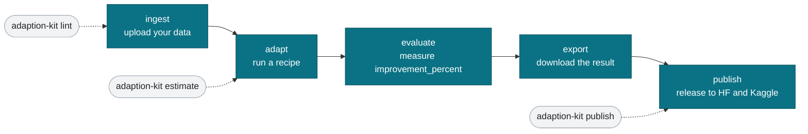
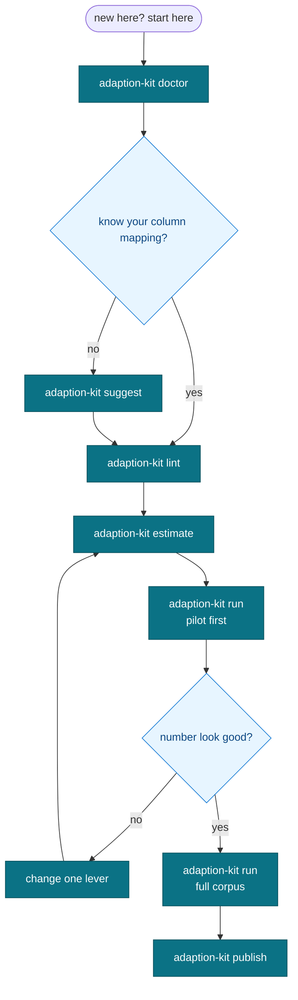
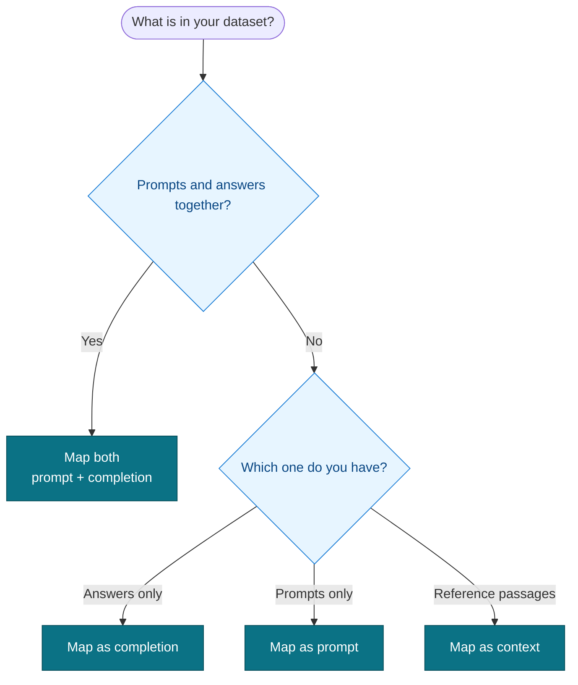
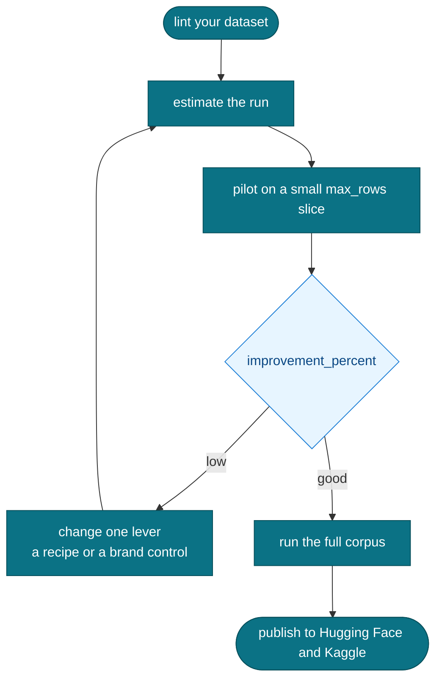
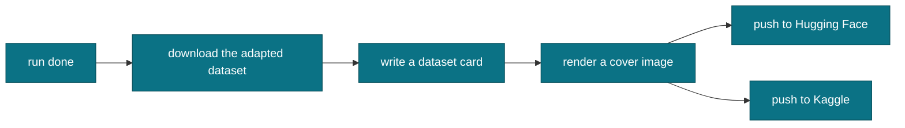

# adaption-devkit

A community, unofficial, open source toolkit for starting fast with Adaption's
Adaptive Data and AutoScientist.

[](./LICENSE)
[](https://www.python.org/)
[](#what-this-is)
[](./CONTRIBUTING.md)

## Unofficial and community

This is an independent, community project. It is **not affiliated with, sponsored
by, or endorsed by Adaption Labs**. "Adaption", "Adaptive Data", "AutoScientist",
and any related names are trademarks of their respective owners and are used here
only to describe what this toolkit helps you do. Always treat the official Adaption
documentation and API as the source of truth. Nothing here is official support.

## Official Adaption resources

For the platform itself, and the team behind it, go to the source:

- [Documentation](https://docs.adaptionlabs.ai/)
- [Blog](https://adaptionlabs.ai/blog)
- [Ambassador program](https://adaptionlabs.ai/blog/ambassador-program)
- [X / Twitter](https://x.com/adaption_ai)
- [LinkedIn](https://www.linkedin.com/company/adaption-labs)

## What this is

adaption-devkit is a small kit that gets a beginner or a student from a raw CSV to
a published, adapted model without burning credits on avoidable mistakes. It is
built around the Adaptive Data lifecycle:


## Why it exists

Read the official docs to learn the platform, then reach for this kit to move faster
and skip the small mistakes that cost real time and credits the first time around:

- A **preflight dataset linter** that catches the always on deduplication
  collapse before you spend credits. Near duplicate rows can shrink your dataset
  to a fraction of its size after you have already paid. The linter warns first.
- A **publish helper**, because the official publish endpoint currently returns
  HTTP 501. The helper packages your release so you can ship to Hugging Face and
  Kaggle anyway.
- **Estimate first run helpers** so you see the credit cost before each run.
- **Decision guides** for column mapping and for recipes and brand controls, so
  you pick the right levers for your domain instead of guessing.
- **Ready templates and cookbook notebooks** so your first run works on the first
  try.

## Features

- `adaption-kit doctor` - check your setup in one shot: Python, the SDK, your env vars, the host.
- `adaption-kit lint` - preflight linter for your dataset, run it before you pay.
- `adaption-kit suggest` - look at your file and recommend the column mapping to use.
- `adaption-kit estimate` - quote credits and time before a run.
- `adaption-kit run` - estimate first wrapper around an adaptation run.
- `adaption-kit publish` - publish helper for the 501 endpoint.
- `adaption-kit card` - generate dataset and model cards.
- `adaption-kit cover` - generate a cover image for your release.
- Guides, runnable cookbook notebooks, and ready to edit templates.

## Install

```bash
git clone https://github.com/A1VARA5/adaption-devkit.git
cd adaption-devkit
pip install -e .
```

Optional extras:

```bash
# the SDK-backed run and publish helpers
pip install -e ".[sdk]"

# everything for the cookbook notebooks
pip install -e ".[notebooks]"
```

If an extra is not installed, the matching command tells you what to add. The
core linter and the guides work with no extras at all.

## Quickstart

Configure access through environment variables. Never hardcode your key.

```bash
export ADAPTION_BASE_URL="https://api.prod.adaptionlabs.ai"
export ADAPTION_API_KEY="your-key-here"
```

On Windows PowerShell:

```powershell
$env:ADAPTION_BASE_URL = "https://api.prod.adaptionlabs.ai"
$env:ADAPTION_API_KEY  = "your-key-here"
```

Then lint your data before you spend anything:

```bash
adaption-kit lint data.csv
```

The linter reports the columns it sees, flags near duplicate rows that the
deduplication pass would collapse, and tells you whether your column mapping looks
right. Fix the warnings, then move on to `estimate` and `run`.

## Repo map

| Path | What is in it |
|------|----------------|
| `adaption_kit/` | the Python package and the `adaption-kit` CLI (`doctor`, `lint`, `suggest`, `estimate`, `run`, `publish`, `card`, `cover`) |
| `guides/` | `quickstart`, `gotchas`, `column-mapping`, `recipes-and-controls`, `release-checklist` |
| `cookbook/` | runnable notebooks that walk the full lifecycle |
| `templates/` | dataset schemas, dataset and model cards, a cover, and Kaggle metadata |
| `graphics/` | the diagrams embedded below, as Mermaid in Markdown |
| `LICENSE` | Apache-2.0 |
| `CONTRIBUTING.md` | how to contribute and the quality bar |
| `CODE_OF_CONDUCT.md` | Contributor Covenant v2.1 |

## Diagrams

### Lifecycle

See [`graphics/lifecycle.md`](./graphics/lifecycle.md).



### Which command do I run

See [`graphics/command-router.md`](./graphics/command-router.md). A quick route from a standing start to a published release.



### Column mapping decision

See [`graphics/column-mapping-decision.md`](./graphics/column-mapping-decision.md).



### Recipe and control matrix

See [`graphics/recipe-matrix.md`](./graphics/recipe-matrix.md) for the full table.

### Credit safe run loop

See [`graphics/credit-safe-run.md`](./graphics/credit-safe-run.md). Estimate, pilot small, read the number, change one lever, then scale.



### Publish flow

See [`graphics/publish-flow.md`](./graphics/publish-flow.md). The publish endpoint returns 501, so you release by hand.



## Contributing

Contributions are welcome and the quality bar is simple: only verified, correct
content, and anything untested is marked as such. Read
[`CONTRIBUTING.md`](./CONTRIBUTING.md) and the
[`CODE_OF_CONDUCT.md`](./CODE_OF_CONDUCT.md) before you open a pull request.

## License

Apache-2.0. Copyright 2026 Aivaras Navardauskas.

Author: Aivaras Navardauskas (MANIFESTA). GitHub: [A1VARA5](https://github.com/A1VARA5).
