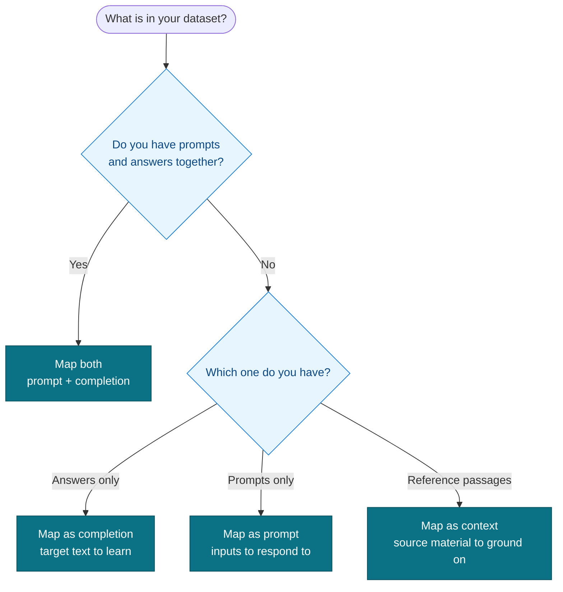

# Column mapping decision tree

Adaptive Data needs to know what each column in your dataset is. The mapping you
choose changes how the recipe reads your rows. Use this tree to pick one. The
full reasoning lives in `guides/column-mapping.md`.

## Quick rules

- Both prompts and answers in your rows: map **both** (`prompt` + `completion`).
- Answers only, no questions: map as **completion**.
- Prompts only, no answers: map as **prompt**.
- Reference passages or source documents: map as **context**.

When in doubt, run `adaption-kit lint data.csv`. The linter reports the columns it
sees and warns when a mapping looks wrong before you spend credits.
