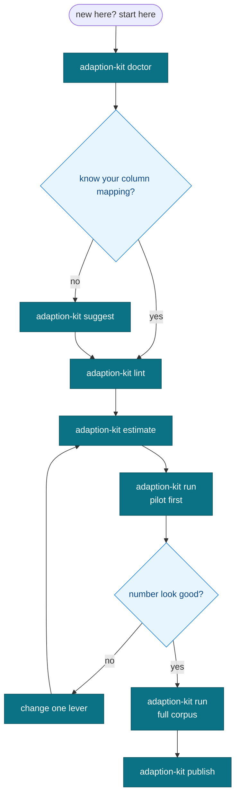

# Which command do I run

A quick route from a standing start to a published release. Each box is a command, so
you never have to wonder what comes next.

If you only remember one thing: run lint before you spend a credit.
