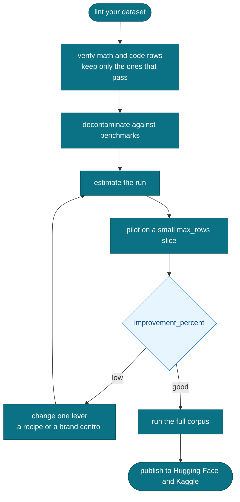

# The credit safe run loop

Spend the least to find the best setup. Estimate, pilot on a small slice, read the
improvement number, change one lever, then repeat. Only scale to the full corpus once
a small run looks good. This is the habit the toolkit is built to encourage.

Change one lever at a time, so you can tell what actually moved the number.
