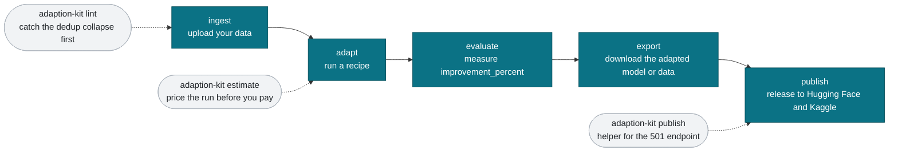

# Lifecycle: ingest to publish

The Adaptive Data lifecycle has five stages. adaption-devkit adds a preflight
linter before you spend any credits, an estimate step before each run, and a
publish helper for the stage where the official endpoint currently returns 501.

## What each stage means

- **ingest** - upload a dataset (CSV or JSONL) and map its columns.
- **adapt** - run a recipe over the data to adapt a frontier model.
- **evaluate** - the run reports an `improvement_percent` versus the baseline.
- **export** - download the adapted artifact for your own use.
- **publish** - release the result so others can reproduce it.

## Where the devkit helps

- Run `adaption-kit lint` before ingest. The platform deduplication pass is
  always on, and near duplicate rows can collapse your dataset to a fraction of
  its size after you have already paid. The linter flags that risk first.
- Run `adaption-kit estimate` before adapt so you know the credit cost up front.
- Use `adaption-kit publish` for the publish stage, since the official publish
  endpoint currently returns HTTP 501.
