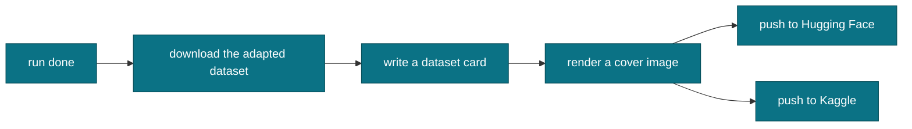

# Publishing your release

The publish endpoint currently returns 501, so you release by hand. The publish helper
packages this for you: it downloads the adapted dataset, writes a card, renders a cover,
and pushes to Hugging Face and Kaggle.

Kaggle datasets start private, so flip the dataset to public when you are ready.
