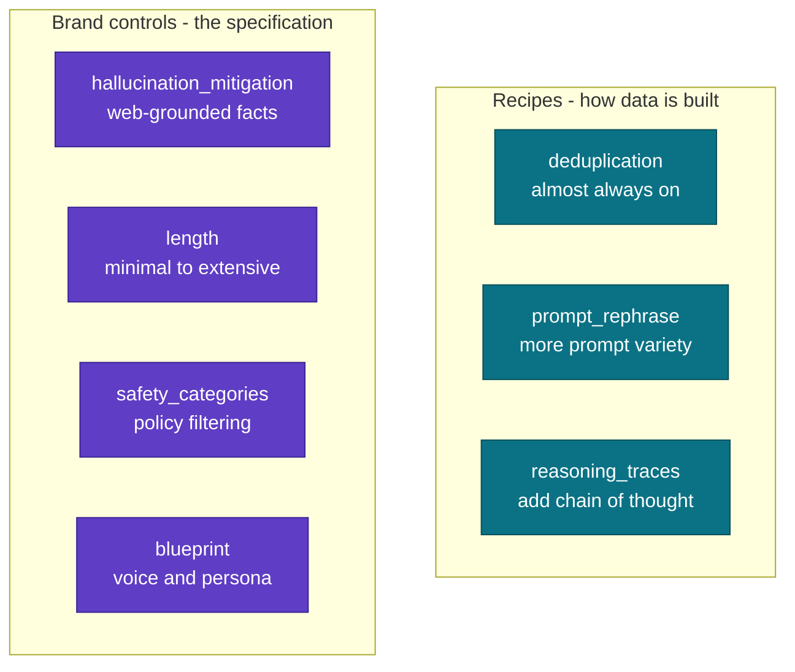

# Recipe and control matrix by domain

The score for an AutoScientist run is its `improvement_percent` on a held out set.
Recipes shape how the data is built. Brand controls encode the quality, safety,
and voice you want. This matrix is a starting point. Always pilot on a small
slice, change one lever at a time, and keep what lifts the percentage. The full
reasoning lives in `guides/recipes-and-controls.md`.

## Starting config per domain

| Domain | deduplication | prompt_rephrase | reasoning_traces | hallucination_mitigation | length | other |
|--------|:---:|:---:|:---:|:---:|:---:|---|
| Marketing / language | yes | yes | no | no | to taste | `blueprint` for voice and target language |
| Math & code | yes | no | yes | no | detailed | objective eval makes the gain defensible |
| Finance / legal / healthcare | yes | no | yes | yes | detailed | `safety_categories` per policy |
| Science | yes | no | yes | yes | detailed | grounding is the main lever |
| Data-viz / charts | yes | no | yes | no | to taste | image `context` columns (multimodal) |
| Unsure / other | yes | yes | A/B test | A/B test | to taste | add one lever at a time, keep what helps |

## Notes

- `deduplication` is on by default on the platform and is almost always worth
  keeping. Run `adaption-kit lint` first so the dedup collapse does not surprise
  you after you have paid.
- `reasoning_traces` is a recipe, not a brand control. Use it where stepwise
  reasoning improves accuracy and can be audited.
- Turn `prompt_rephrase` off when your prompts are curated and must stay verbatim.
- `blueprint` applies a qualitative voice or policy as a system prompt on every
  completion. It is the main lever for the marketing and language domains.
